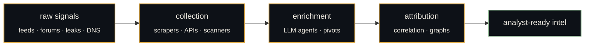

<!--
  ──────────────────────────────────────────────────────────────
  Taleb Mujahed · {T}
  OSINT · Security Automation · Claude Code operator
  ──────────────────────────────────────────────────────────────
-->

<div align="center">

<br>

```text
   ━━━━━━━━━━━━━━━━━━━━━━━━━━━━━━━━━━━━━━━━━━━━━━━━━━━━━━━━━━━

                              ╭─────────╮
                              │   {T}   │
                              ╰─────────╯

                   osint  ·  research  ·  automation

   ━━━━━━━━━━━━━━━━━━━━━━━━━━━━━━━━━━━━━━━━━━━━━━━━━━━━━━━━━━━
```

<a href="https://github.com/rumble773">
  
</a>

<br><br>


</div>

<br>

```text
> whoami
  Taleb Mujahed — Security Engineer @ spiderSilk · SRO
  OSCP  ·  2× CVE  ·  automation maximalist  ·  quiet operator

> mission
  Build the tools that let analysts skip the manual parts.
  Compress hours of research into seconds of pipeline.
  Then run them every hour for two years without touching them.
```

---

## ━━━  the work  ━━━━━━━━━━━━━━━━━━━━━━━━━━━━━━━━━━━━━━━━━━━━━

At **spiderSilk** I sit in **SRO** (Security Research & Operations). The work is exposure management, attribution, visibility scanning, infostealer telemetry, dark-web chatter, brand protection — the unglamorous infrastructure of catching threats before they catch a customer.

Most of what I ship is internal. Pipelines no one will pin, dashboards no one will tweet about, agents that quietly run at 3am and have already saved someone's morning before they wake up.



---

## ━━━  what I'm actually good at  ━━━━━━━━━━━━━━━━━━━━━━━━━━

<table>
<tr>
<td width="50%" valign="top">

### `osint & research`

- **Attribution work** — chains of evidence, pivots, infrastructure correlation
- **Visibility scanning** — finding what a target actually exposes
- **Dark web & forum telemetry** — collection that doesn't trip on its own shoelaces
- **Infostealer triage** — turning logs into named victims and named actors
- **Brand & impersonation** — lookalikes, takedowns, supply-chain risk

</td>
<td width="50%" valign="top">

### `automation & ai`

- **Claude Code operator** — hundreds of hours, not a chatbot user
- **Agent orchestration** — multi-agent research loops, parallel dispatch
- **Custom skills + subagents** for repeatable security workflows
- **Hooks & MCP servers** as deterministic guardrails over an LLM
- **Headless pipelines** — Claude as a callable tool inside cron, not a window

</td>
</tr>
</table>

---

## ━━━  claude code mastery  ━━━━━━━━━━━━━━━━━━━━━━━━━━━━━━━━

> The multiplier is real once you stop treating the model like a chatbot
> and start treating it like a teammate who never sleeps and reads every file.

What I've put hundreds of hours into, in plain terms:

```text
  ▸ custom skills + subagents      reusable workflows that survive a context wipe
  ▸ hook architecture              deterministic guardrails around a non-deterministic model
  ▸ MCP servers as tool fabric     model → tools → real systems, properly typed
  ▸ multi-agent orchestration      parallel research dispatch, scatter-gather
  ▸ headless / programmatic use    cron-callable Claude inside pipelines
  ▸ prompt caching + context eng.  cost goes down, quality goes up — pick both
  ▸ eval harnesses                 tied to real OSINT tasks, not benchmark vibes
  ▸ agentic loop discipline        knowing when one-shot beats agentic and back
```

If you're doing serious security automation with Claude and feel like you're alone in the room — you're not.

<details>
<summary><b>a few patterns I keep reaching for</b></summary>

<br>

```text
  • "scatter-gather" — fan out N research subagents, merge into one report
  • "verifier pair"  — one model proposes, a second model adversarially reviews
  • "skill-first"    — encode workflows as skills before encoding them as prompts
  • "hook trapdoor"  — let the hook layer enforce what the prompt only requests
  • "evals before prompts" — fix the measurement, the prompt fixes itself
  • "headless > UI"  — if it runs twice, it shouldn't live in a chat window
```

</details>

---

## ━━━  stack  ━━━━━━━━━━━━━━━━━━━━━━━━━━━━━━━━━━━━━━━━━━━━━━

```text
  languages    python · bash · c++
  security     OSINT · API pentesting · attribution · threat research
  ai / llm     claude code · anthropic SDK · MCP · agents · evals
  automation   custom pipelines · n8n / make · cron everywhere
  cloud        aws · oci · linux
  daily        zsh · vscode · the terminal, mostly
```

---

## ━━━  selected credentials  ━━━━━━━━━━━━━━━━━━━━━━━━━━━━━━━

| credential                          | issuer                       | year |
| :---------------------------------- | :--------------------------- | :--- |
| **OSCP**                            | Offensive Security           | 2023 |
| OCI 2024 Generative AI Professional | Oracle                       | 2024 |
| API Penetration Testing             | APIsec University            | 2023 |
| AWS Cloud Practitioner              | Amazon Web Services          | 2023 |
| Scientific Computing with Python    | freeCodeCamp                 | 2024 |
| Cyber Security Foundation           | CertiProf                    | 2021 |

```text
   +  2 published CVEs
   +  CTF play, when there's time
   +  a longer tail of certs that didn't make the cut
```

---

## ━━━  how I work  ━━━━━━━━━━━━━━━━━━━━━━━━━━━━━━━━━━━━━━━━

> **Root cause, not symptom.** A patched bug is a returning bug.
>
> **Small surface, sharp tools.** One script that runs for two years beats ten that rot in a quarter.
>
> **Boring and reliable** beats clever and fragile, every single time.
>
> **Ship, then talk.** The work should speak before I do.

---

## ━━━  contact  ━━━━━━━━━━━━━━━━━━━━━━━━━━━━━━━━━━━━━━━━━━━━

<div align="center">

For work, research, or a sharp question — quiet channels preferred.

<br>

<a href="https://www.linkedin.com/in/talebmujahed/"></a>
&nbsp;
<a href="https://medium.com/@rumble773"></a>
&nbsp;
<a href="mailto:taleb991@protonmail.com"></a>
&nbsp;
<a href="https://github.com/rumble773"></a>

</div>

<br>

```text
   ━━━━━━━━━━━━━━━━━━━━━━━━━━━━━━━━━━━━━━━━━━━━━━━━━━━━━━━━━━━

                       forged  ·  sealed  ·  signed

                "I do my best"  —  quiet  ·  on purpose

   ━━━━━━━━━━━━━━━━━━━━━━━━━━━━━━━━━━━━━━━━━━━━━━━━━━━━━━━━━━━
```
